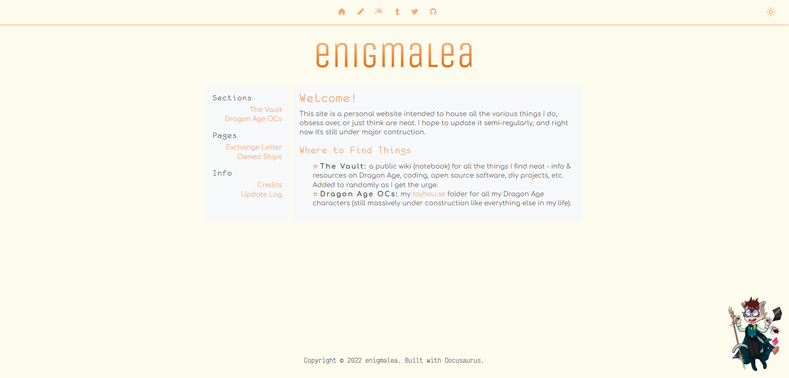
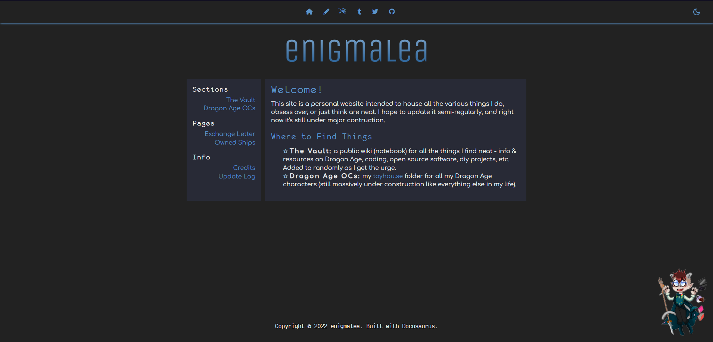

I've been wanting to update my themes for a bit and a few weeks ago while
working on a project using the [Dracula Dark Theme](https://draculatheme.com), I
ran across [Catpuccin](https://catppuccin.com) which offers four different
themes (one light and three dark). I liked the pastels so much, I had to use
them for my website theme.

The old color schemes below are being retired.

<figure>

<figcaption>Old Light Theme</figcaption>

</figure>

<figure>

<figcaption>Old Dark Theme</figcaption>

</figure>
